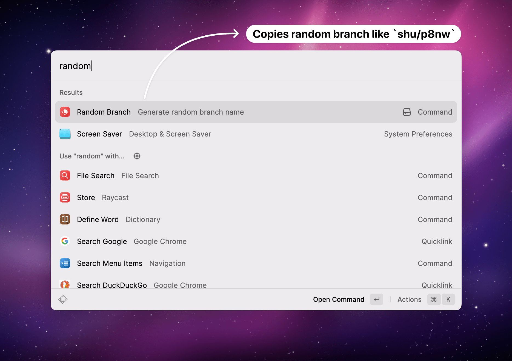

# Random Branch

A [Raycast](https://raycast.com) plugin to generate random git branch names.

This plugin/repository was created via the built-in command of Raycast: https://developers.raycast.com/basics/create-your-first-extension.

